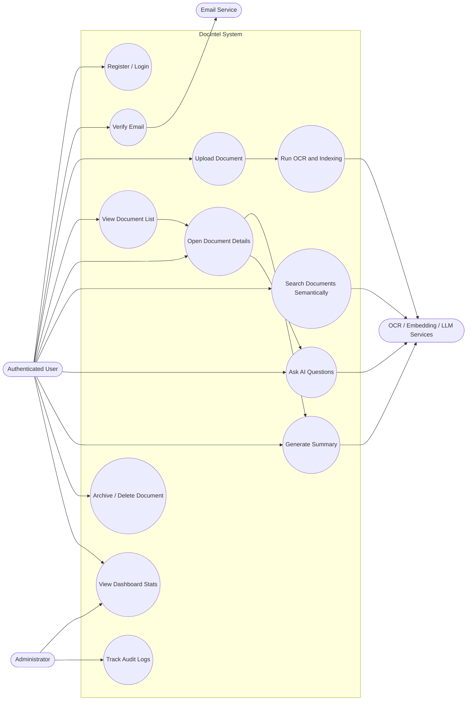
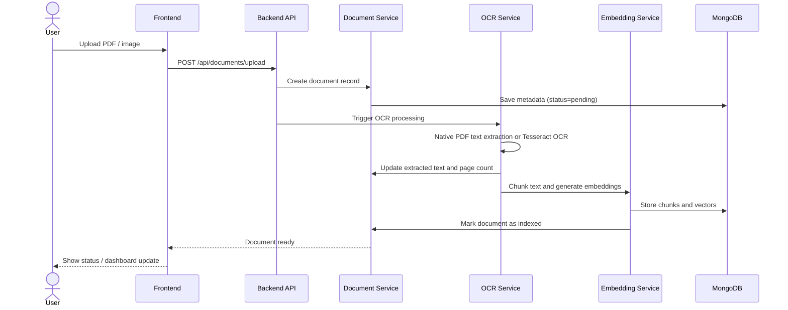
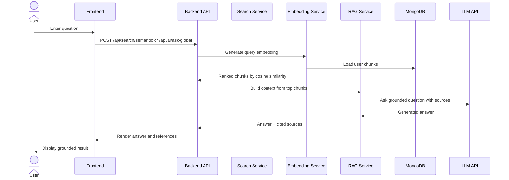
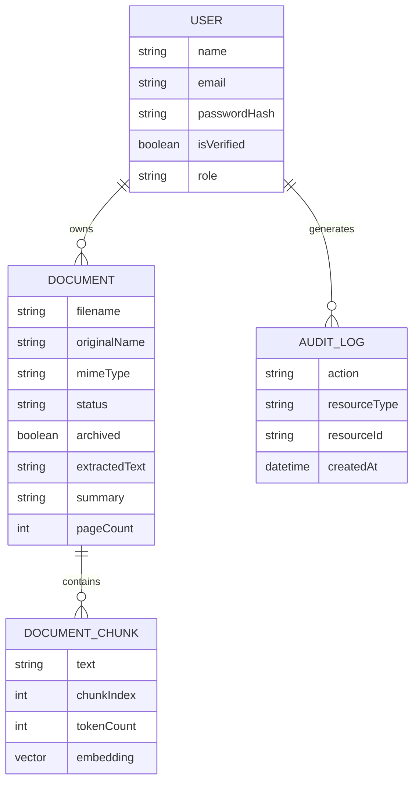
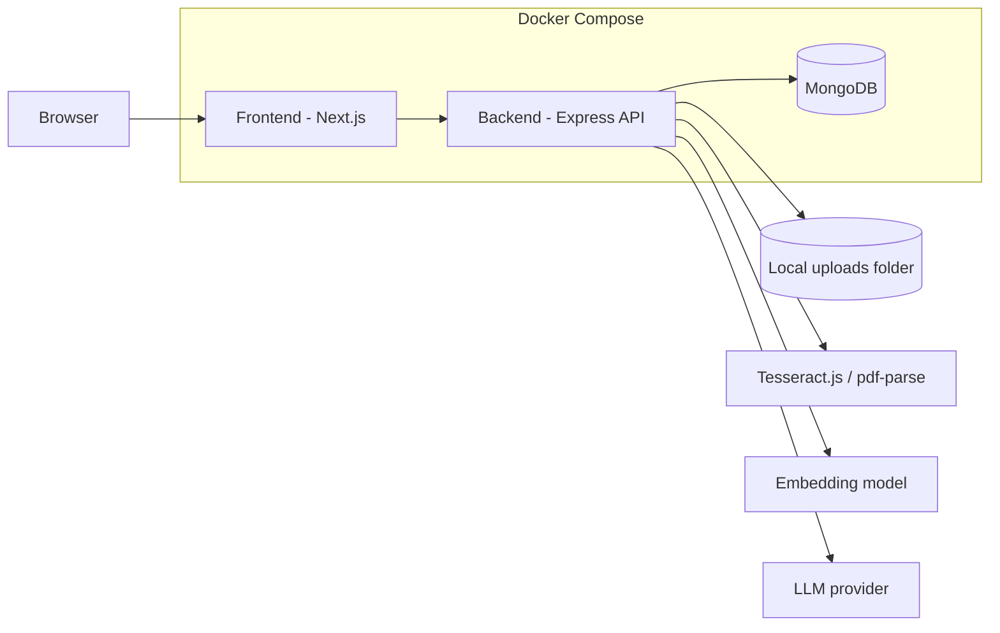

# PFE Diagrams - Intelligence Documentaire

This file contains Mermaid diagrams you can reuse in your PFE report.

## 1. System Architecture

```mermaid
flowchart LR
  U[User] --> F[Frontend - Next.js App Router]
  F -->|REST /api| B[Backend - Express API]

  B --> A[Auth Module]
  B --> D[Document Module]
  B --> S[Search Module]
  B --> AI[AI Module]
  B --> O[OCR Module]
  B --> E[Embeddings Module]
  B --> R[RAG Module]
  B --> AU[Audit Module]

  D --> M[(MongoDB)]
  A --> M
  S --> M
  AI --> M
  O --> M
  E --> M
  R --> M
  AU --> M

  O --> T[Tesseract.js]
  O --> P[pdf-parse]
  E --> X[@xenova/transformers]
  AI --> LLM[LLM API]
  R --> LLM
  F --> C[UI components / Tailwind / i18n]
```

## 2. Global Use Case Diagram

> Version detaillee recommandee pour le rapport: [`docs/use-case-global.md`](use-case-global.md).



## 3. Document Processing Pipeline



## 4. Semantic Search And RAG



## 5. Data Model



## 6. Deployment View



## Suggested report captions

- `Figure 1` - Global architecture of the document intelligence platform
- `Figure 2` - Global use case diagram of the system
- `Figure 3` - Document upload, OCR and indexing workflow
- `Figure 4` - Semantic search and RAG answer generation
- `Figure 5` - Simplified data model
- `Figure 6` - Deployment architecture
