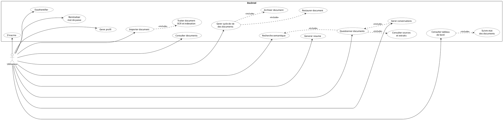
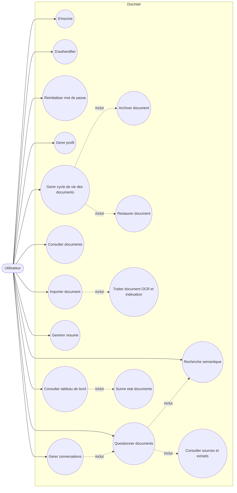

# Diagramme de cas d'utilisation global - DocIntel

Cette version est adaptee pour un rapport PFE : elle garde un seul acteur principal
et presente les grandes fonctionnalites de la plateforme sans surcharger le schema.

## Version PlantUML recommandee

## Version Mermaid

## Description courte pour le rapport

Le diagramme de cas d'utilisation global presente les principales interactions entre
l'utilisateur et la plateforme DocIntel. L'utilisateur peut acceder au systeme,
gerer son profil, importer et consulter ses documents, lancer leur traitement,
gerer leur cycle de vie en les archivant ou en les restaurant, effectuer des
recherches semantiques, generer des resumes, poser des questions aux documents
et suivre l'etat general depuis le tableau de bord.
